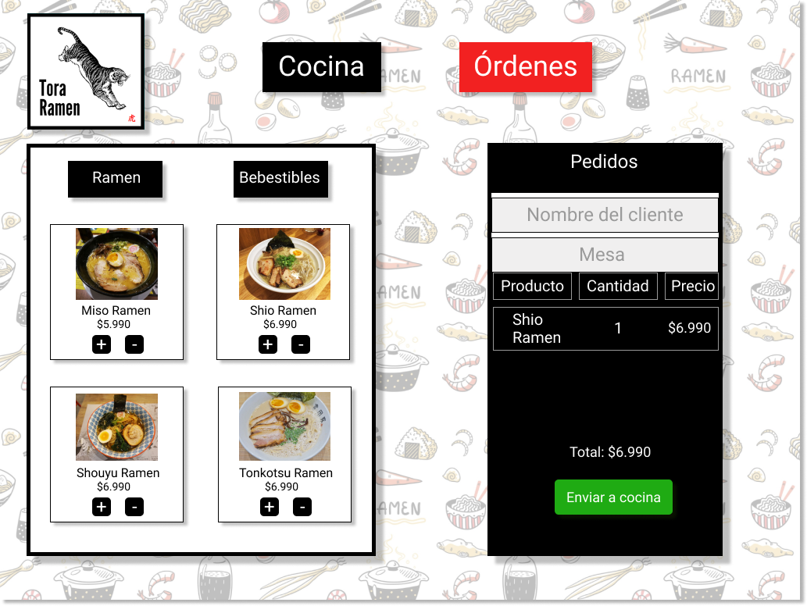
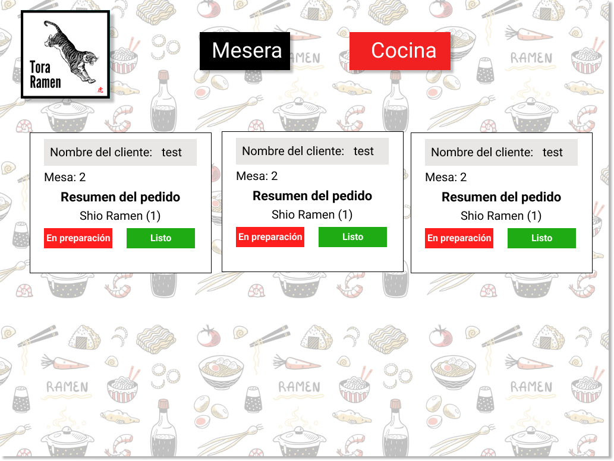
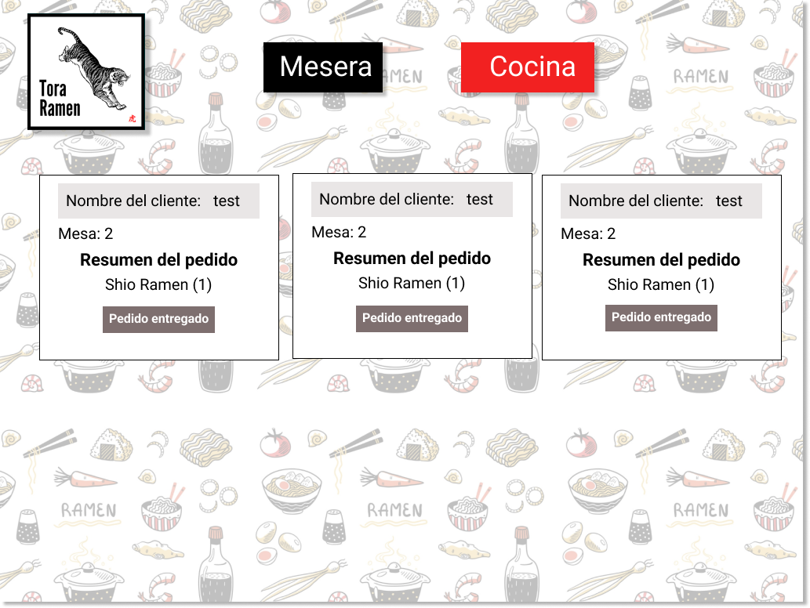
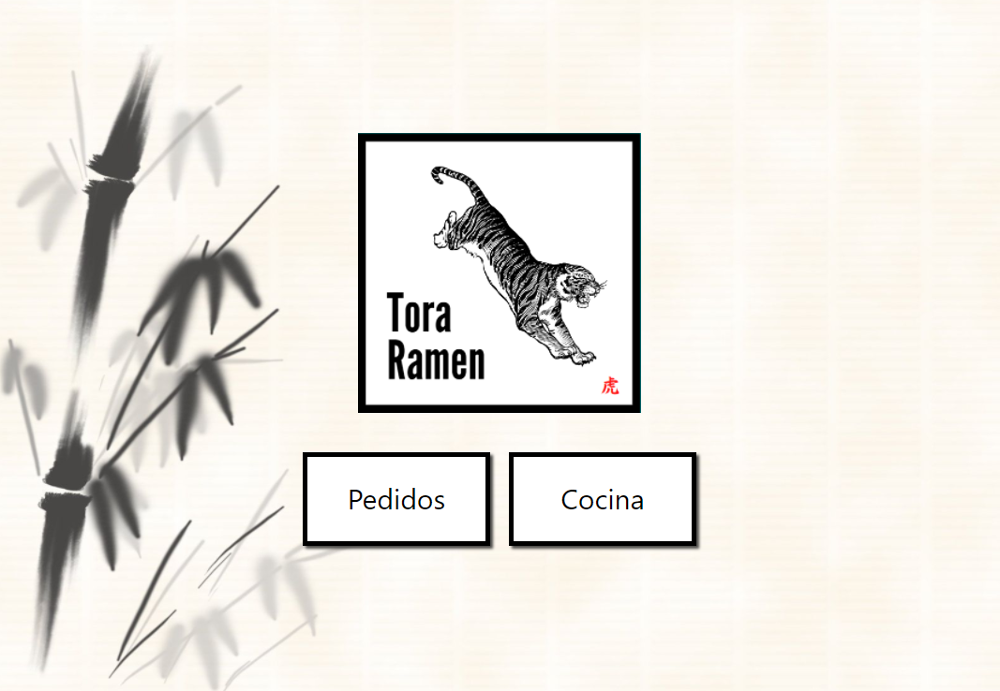
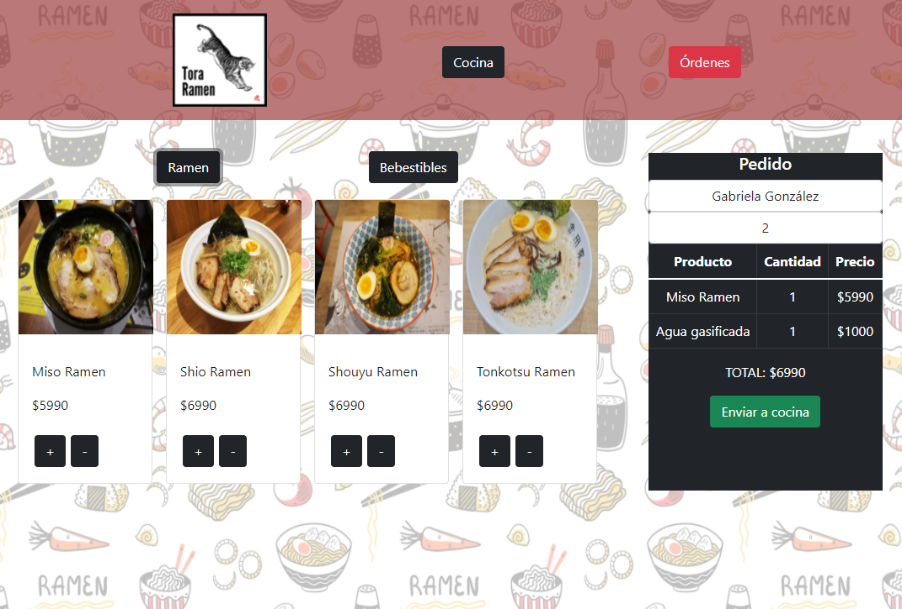
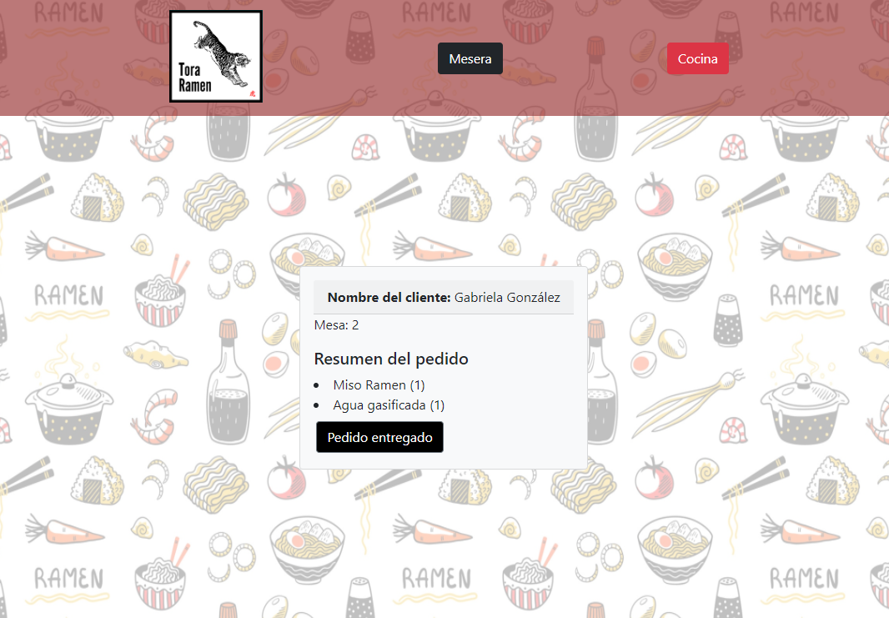

# Tora Ramen 🥣

* [1. Introducción](#1-introducción)
* [2. Presentación del proyecto](#2-Presentación-del-proyecto)
* [3. Historias de usuario](#3-Historias-de-usuario)
* [4. Prototipo de alta fidelidad](#4-Prototipo-de-alta-fidelidad)
* [5. Página finalizada](#5-Página-finalizada)

## 1. Introducción

Un pequeño restaurante de ramen, que está creciendo, necesita una interfaz en la que puedan tomar pedidos usando una tablet, y enviarlos a la cocina para que se preparen ordenada y eficientemente.

## 2. Presentación del proyecto

El cliente solicita una aplicación que será ocupada en tablet. Esta deberá ser ocupada por los trabajadores del restaurant. En primer lugar, el mesero podrá ingresar los productos a una comanda, en conjunto al nombre y la mesa del cliente. Esta información tendrá que llevar a manos del cocinero para que pueda preparar los platos. Una vez preparados los pedidos, el cocinero podrá marcar las órdenes como "listas" para que el mesero venga a retirar la orden y servirla a la mesa correspondiente.

## 3. Historias de usuario

#### [Historia de usuario 1]: Mesero/a debe poder tomar pedido de cliente

Yo como meserx quiero tomar el pedido de un cliente para no depender de mi mala
memoria, para saber cuánto cobrar, y enviarlo a la cocina para evitar errores y
que se puedan ir preparando en orden.

#### Criterios de aceptación

* Anotar nombre de cliente.
* Agregar productos al pedido.
* Eliminar productos.
* Ver resumen y el total de la compra.
* Enviar pedido a cocina (guardar en alguna base de datos).
* Se ve y funciona bien en una _tablet_.

***

#### [Historia de usuario 2]: Jefe de cocina debe ver los pedidos

Yo como jefx de cocina quiero ver los pedidos de los clientes en orden y
marcar cuáles están listos para saber qué se debe cocinar y avisar a lxs meserxs
que un pedido está listo para servirlo a un cliente.

#### Criterios de aceptación

* Ver los pedidos ordenados según se van haciendo.
* Marcar los pedidos que se han preparado y están listos para servirse.

#### [Historia de usuario 3]: Meserx debe ver pedidos listos para servir

Yo como meserx quiero ver los pedidos que están preparados para entregarlos
rápidamente a los clientes que las hicieron.

#### Criterios de aceptación

* Ver listado de pedido listos para servir.
* Marcar pedidos que han sido entregados.

## 4. Prototipo de alta fidelidad

### Prototipo Home

### Prototipo Mesera

### Prototipo Cocina

### Prototipo Pedidos entregados

## 5. Página finalizada

### Home

### Mesera

### Cocina

### Pedidos entregados

